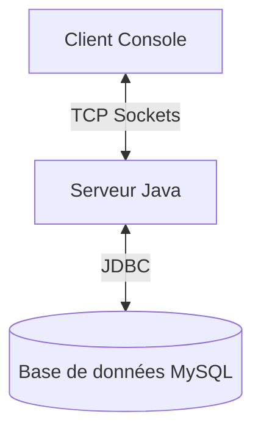

# Cahier de Charges : Application Client-Serveur Java Sécurisée

## 1. Présentation du Projet

Ce projet consiste en une application Client-Serveur robuste développée en Java, permettant l'authentification sécurisée des utilisateurs via une architecture réseau TCP et une base de données MySQL.

## 2. Objectifs

- Fournir une plateforme d'authentification robuste.
- Assurer la gestion simultanée de plusieurs clients (Multi-threading).
- Implémenter des standards de sécurité modernes (Hachage de mots de passe).
- Offrir une interface utilisateur console intuitive et dynamique.

## 3. Spécifications Fonctionnelles

### 3.1. Serveur

- **Écoute Réseau** : Le serveur doit écouter sur le port 5000.
- **Multi-threading** : Capacité à gérer plusieurs connexions client en parallèle.
- **Authentification** : Vérification des identifiants par rapport à une base de données MySQL.
- **Protocole** : Support des commandes :
  - `LOGIN <user> <pass>` : Authentification.
  - `STATUS` : Informations sur la session actuelle.
  - `EXIT` : Déconnexion propre.

### 3.2. Client

- **Interface Console** : Menu interactif.
- **Communication** : Envoi de commandes au serveur et affichage des réponses.
- **UX** : Utilisation de couleurs ANSI et de bannières ASCII pour une meilleure visibilité.

## 4. Spécifications Techniques

- **Langage** : Java 17.
- **Base de Données** : MySQL 8.0+.
- **Connectivité** : JDBC (Java Database Connectivity).
- **Gestionnaire de Projet** : Maven.
- **Sécurité** :
  - Hachage SHA-256 pour les mots de passe.
  - `PreparedStatement` pour prévenir les injections SQL.

## 5. Architecture

## 6. Livrables

- Code source complet (Modules Client et Serveur).
- Script SQL de création de base de données.
- Documentation technique et manuel d'utilisation (README.md).
- Cahier de charges fonctionnel.
